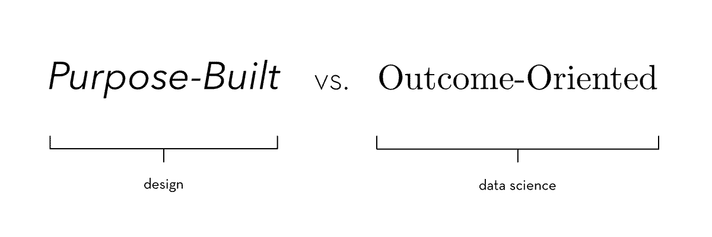

---
# This page uses Hydejack's `about` layout, which shows the primary author's picture and about text at the top.
layout: about
cover: true

# The title of the page.
title: Information

# You can show the description on the page by deleting this line:
hide_description: true

# Setting `menu` will generate an entry in the sidebar.
menu: true
order: 1

# This description is used to preview the page on search engines, social media, etc.
description: >
  A course at the Stanford d.School on the intersection of Design
  and ML (machine learning) that is offered in the Winter quarter
  of 2018-2019
---

Designing Machine Learning is a project by the [Stanford d.School] to make Maching Learning (ML) more accessible to innovators from all disciplines. We believe that ML will soon be a widespread feature of products, services, systems, and experiences in all walks of life. In order to make this computational revolution possible, as well as to ensure that it closely follows human values, we must empower a new generation of professionals to incorporate ML into their creative process.

<h2>Reference</h2>
1. TOC
{:toc}

## Preface 
Design is the exploration of possibility, at once a critique of the present and a supreme optimism about human ingenuity. In a way, machines are design made manifest. Machines are programmable constructs, giving limitless potential and new forms of agency to the designer. Machine learning is yet another axis of empowerment, still incipient in its capabilities. Perhaps it is the humility with which we have previously approached machine learning that has prevented us from applying it pervasively, or exposing it to wider inquiry.
{:.lead}

## Motivation

Traditionally, designers have 
{:.lead data-width="1200" data-height="400"}
The discontinuity in values between fields
{:.figure}

_More information coming soon_

[Stanford d.school]: http://dschool.stanford.edu